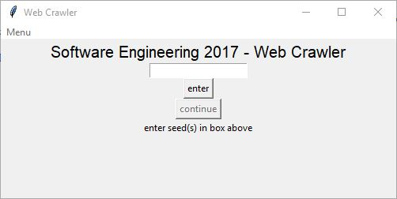

# Job Scraper - User Documentation
Software Engineering Class 2017 @ EMU

## List of steps the user should follow to implement the Job Scraper

### 1. Run the Python file labeled **main.py**
Doing so will yield the following screen

### 2. Supply seed(s)

- Enter seed, then click **enter** button
  
  - Repeat until all seeds are entered
  

- Click **continue** to move to next step
### 3. Supply keyword(s)

- Enter keyword, then click **enter** button
  - Repeat until all keywords are entered
- Click **continue** to move to next step
### 4. Supply termination choice
### 5. Supply termination value
### 6. Close window
